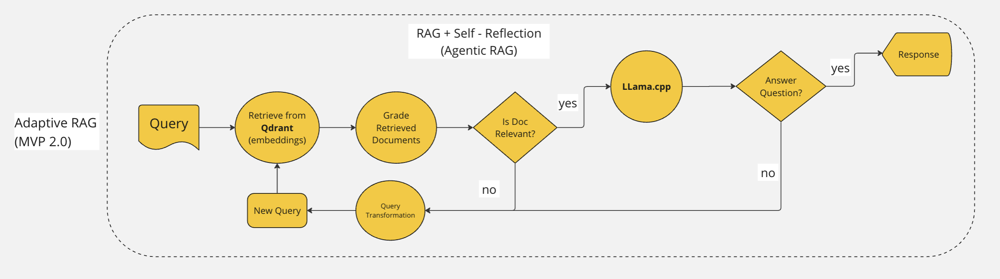

# Local-RAG

Build RAG using Local Llama-cpp and Qdrant in Disk

## Vanilla RAG Architecture


## Adaptive RAG Archtecture



## Repo Structure

```
Local-RAG
│   README.md
│   requirements.txt
│   .gitignore
└───_documentation (one time or manually operation)
│   │   README.md
└───config
└───data
└───models
└───secrets
└───src
│   └───preprocessing
        │   doc_preprocessing.py
│   └───vanila
│       │   rag.py
│   └───agent
└───utils
```

## Install

```
pip install -r requirements.txt
```

## Usage / Getting started

```
python3 main.py
```
